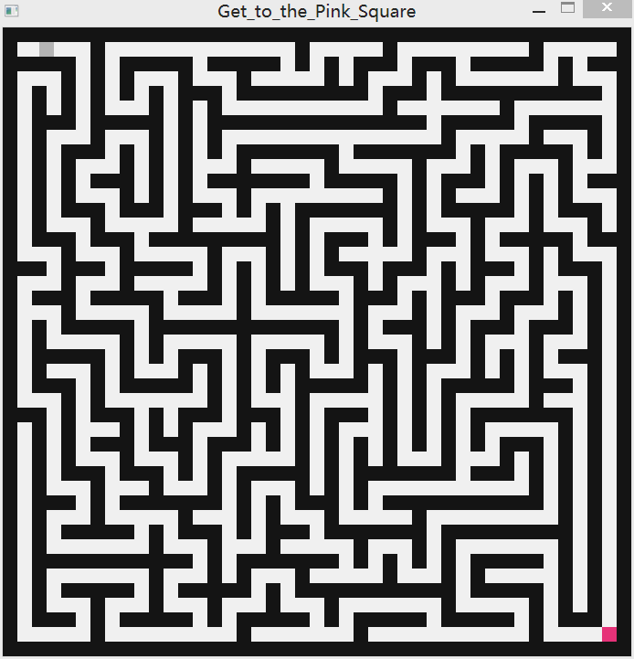

# maze_generator
This is a C++ maze generator using recursive backtracking algorithm and SDL2. 
The starting point is at the top left corner and the finish point is at the bottom right corner.
Once the player hits the finish point, a new maze game starts, and the game is on until the player hits the 'X' at the top right corner.  

Screenshot: 

